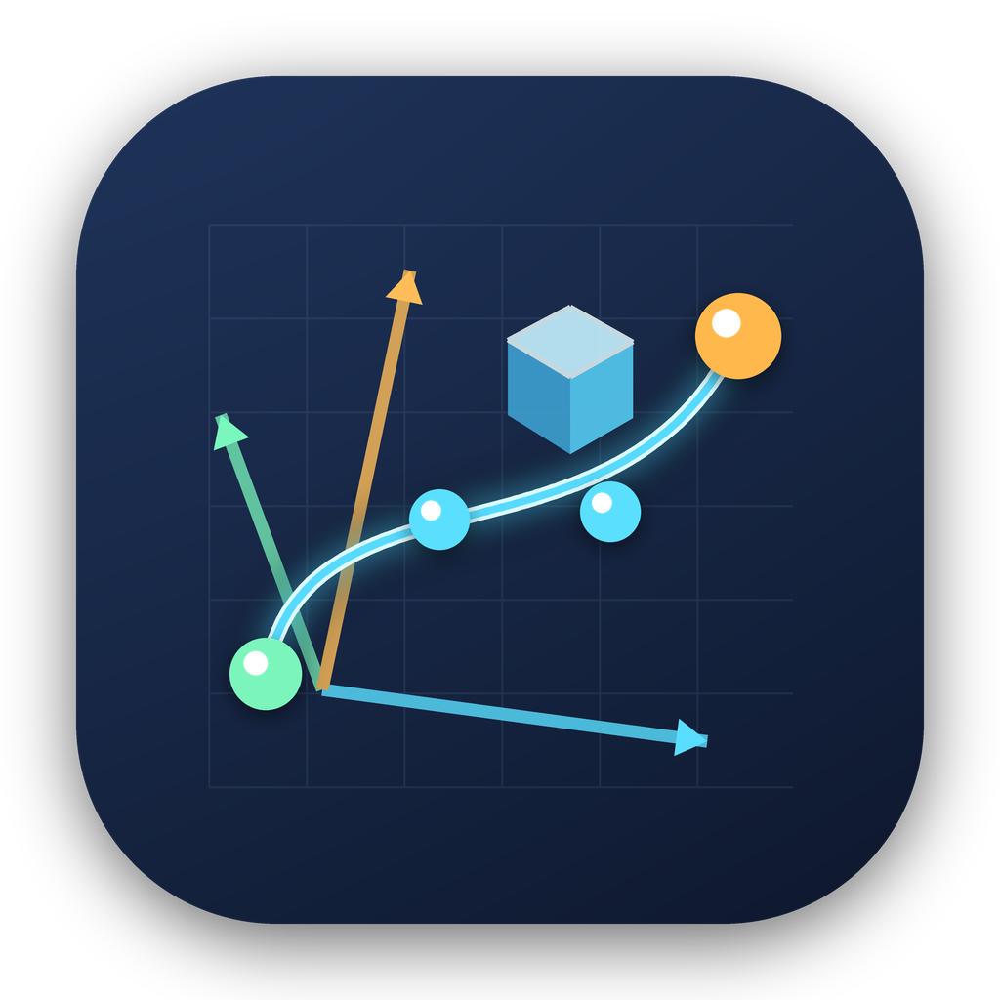

# IsaacLab Trace Monitor

<p align="center">
  
</p>

[](https://github.com/Microttus/isaaclab-trace-monitor/actions/workflows/ci.yml)

Desktop application for live monitoring and offline playback of bounded Isaac
Lab object-trajectory logs.

> **Independent community project:** IsaacLab Trace Monitor is not affiliated
> with or endorsed by NVIDIA or the Isaac Lab project.
>
> **Development disclosure:** substantial portions of the initial application,
> logger, tests, build scripts, and documentation were created with assistance
> from OpenAI's ChatGPT. The app has no OpenAI runtime dependency and does not
> send trace data to OpenAI. See [AI_ASSISTANCE.md](AI_ASSISTANCE.md).

## Features

- Live monitoring of a headless training run over SSH and `rsync`
- Offline playback of current, latest-completed, and retained episodes
- Search/source field accepting local folders and Coder SSH sources
- Rotatable 3D trajectories for all logged objects
- Position and quaternion-orientation inspection
- Reward, cumulative return, episode-return, and episode-length plots
- Play, pause, seek, step, speed, loop, trail, and follow-newest controls
- Restrictive synchronization that excludes retained episodes by default
- Native macOS `.app`, `.dmg`, and portable `.zip` build support
- Generic Isaac Lab/Stable-Baselines3 logging callback included under
  [`examples/isaaclab_logger`](examples/isaaclab_logger)

## Supported platforms

- **macOS:** primary supported platform; source runner and native app builder
- **Linux:** source installation is tested in CI
- **Windows:** not currently tested

Isaac Sim and Isaac Lab are not required on the monitoring computer. They are
only required on the training system that produces the logs.

## Install and run

Python 3.10 or newer is required.

```bash
./run_monitor.sh
```

The first run creates `.venv`, installs the project in editable mode, and starts
the application. A normal installation is also supported:

```bash
python3 -m venv .venv
source .venv/bin/activate
python -m pip install .
isaaclab-trace-monitor
```

Open the included synthetic trace:

```bash
./run_monitor.sh ./example_object_traces
```

## Source field

The source field accepts a local trace root:

```text
/Users/your-name/IsaacLogs/run_01/object_traces
```

or an SSH/`rsync` source:

```text
coder.<workspace>:/absolute/path/to/object_traces
```

The selected local path may be the `object_traces` directory, its parent run
directory, a `live` or `episodes` subdirectory, or a specific trace CSV.

Remote paths are intentionally restricted to absolute paths without spaces or
shell metacharacters. This keeps public-facing `rsync` invocation predictable.

## Coder live monitoring

Configure the Coder workspace as a normal SSH host on the Mac:

```bash
coder config-ssh --no-wildcard
ssh coder.<workspace> true
```

Verify the log path:

```bash
ssh coder.<workspace> \
  'ls /absolute/path/to/object_traces/live/status.json'
```

Enter this source in the application:

```text
coder.<workspace>:/absolute/path/to/object_traces
```

By default the application synchronizes only:

```text
metadata.json
episode_summary.csv
live/
```

Retained `episodes/` are excluded unless **Sync retained episodes** is enabled.
The local remote-source cache is stored below:

```text
~/Library/Caches/IsaacLabTraceMonitor/
```

The application uses the existing SSH/Coder configuration and never stores a
password or private key.

More detail: [docs/live-monitoring.md](docs/live-monitoring.md).

## Logger integration

The monitor reads the bounded wide CSV format generated by the included
`ObjectTraceCallback`:

```text
examples/isaaclab_logger/object_trace_callback.py
```

The callback records complete object poses, bounded current/latest files,
optional retained episodes, a compact episode summary, and status metadata. It
can capture the true pre-reset terminal pose for compatible manager-based Isaac
Lab environments.

See:

- [Logger integration example](examples/isaaclab_logger/README.md)
- [Trace format specification](docs/trace-format.md)

## Playback behavior

Playback time is derived from:

```text
episode_step * metadata.simulation_step_dt_s
```

When simulation timing metadata is unavailable, relative `wall_time_s` is used.
The **Trail** value is a sample count; selecting **Full** shows the complete path
up to the selected frame.

## Build the macOS application

Run on macOS:

```bash
./build_macos_app.sh
```

The finished products are written to `dist/`:

```text
dist/IsaacLab Trace Monitor.app
dist/IsaacLab-Trace-Monitor-1.2.0-macOS.dmg
dist/IsaacLab-Trace-Monitor-1.2.0-macOS.zip
```

The script uses a temporary PyInstaller work directory, validates the finished
bundle, adds the application icon, collects available third-party license
files, applies an ad-hoc signature, and creates the disk image and archive.

An ad-hoc signature is intended for local testing. Broad public binary
distribution should use Apple Developer ID signing and notarization.

More detail: [docs/building-macos.md](docs/building-macos.md).

## Development

```bash
python3 -m venv .venv-dev
source .venv-dev/bin/activate
python -m pip install -e '.[dev]'
ruff check .
pytest
```

## Prepare your GitHub repository

This source archive contains a deliberate repository-owner placeholder because
the GitHub account name is not known. Replace it with one command before the
first commit:

```bash
python3 tools/configure_repository.py --github-owner YOUR_GITHUB_USERNAME
```

Then follow [PUBLICATION_CHECKLIST.md](PUBLICATION_CHECKLIST.md).

## Security

Remote sources invoke `rsync` without a local shell, use an end-of-options
separator, and accept only a constrained SSH host/path syntax. Report suspected
vulnerabilities according to [SECURITY.md](SECURITY.md).

## License and notices

The project is licensed under the [BSD 3-Clause License](LICENSE). Third-party
components remain under their own licenses; see
[THIRD_PARTY_NOTICES.md](THIRD_PARTY_NOTICES.md).

## Citation

Citation metadata is provided in [CITATION.cff](CITATION.cff).
